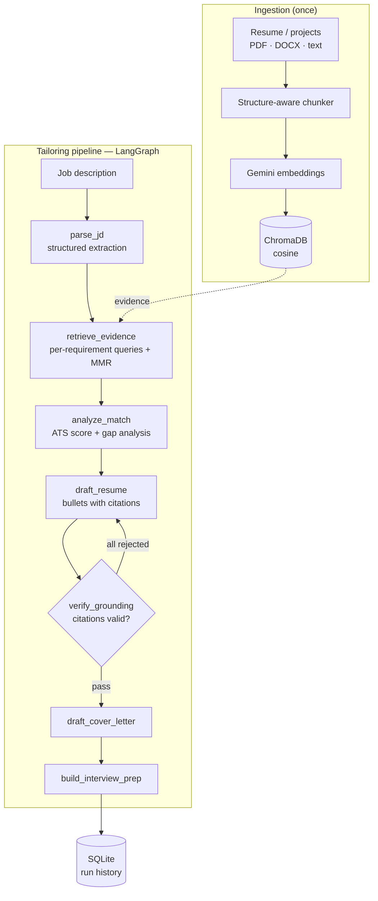

# AI Job-Hunt Copilot

A RAG + agentic AI service that turns a job description into tailored resume bullets, a cover
letter, and interview prep — **grounded in your own indexed experience**, with a critic that
rejects anything it cannot trace back to evidence.

The interesting problem here is not generation. It is *refusing to generate*: an LLM asked to
"tailor a resume" will happily invent a Kubernetes migration you never did. This service makes
that structurally impossible — every bullet must cite the ID of a retrieved chunk, and a
deterministic verification node drops the ones that don't.

```
FastAPI  ·  LangGraph  ·  ChromaDB  ·  Gemini  ·  SQLite  ·  Docker
```

---

## Architecture



**Why the pipeline is shaped this way**

| Decision | Reasoning |
|---|---|
| One retrieval query *per requirement*, not one per JD | A single averaged JD embedding buries niche requirements. Expanding to per-requirement queries surfaces the one project that proves "vector databases". |
| MMR re-ranking (λ = 0.65) | Resume corpora repeat the same stack across projects. Pure top-k returns near-duplicates; MMR trades a little relevance for evidence diversity. |
| Deterministic grounding critic, not LLM-as-judge | A citation either resolves to a retrieved chunk ID or it doesn't. Using a model to check the model adds cost, latency, and a second hallucination surface. |
| Bounded self-correction (1 retry) | If every bullet is rejected, the violations are fed back as instructions and the drafter runs once more. Unbounded loops burn tokens without converging. |
| Caller-supplied embeddings | Keeps the vector store provider-agnostic and stops Chroma from pulling its default ONNX model at runtime. |
| `FakeLLM` / `FakeEmbedder` providers | The entire graph runs offline and deterministically, so CI tests real pipeline behaviour instead of mocking it away. |

---

## Quickstart

```bash
git clone https://github.com/<your-username>/ai-jobhunt-copilot.git
cd ai-jobhunt-copilot

python -m venv .venv && source .venv/bin/activate   # Windows: .venv\Scripts\activate
pip install -r requirements-dev.txt

cp .env.example .env        # add your GOOGLE_API_KEY (free: aistudio.google.com/apikey)
make dev                    # http://localhost:8000
```

Open <http://localhost:8000> for the UI, or <http://localhost:8000/docs> for the OpenAPI console.

**No API key?** Everything still runs:

```bash
make test    # 24 tests, offline
make eval    # evaluation harness, offline
LLM_PROVIDER=fake make dev
```

With Docker:

```bash
docker compose up --build
```

---

## API

| Method | Endpoint | Purpose |
|---|---|---|
| `POST` | `/api/v1/profile/documents` | Index a document from raw text |
| `POST` | `/api/v1/profile/documents/upload` | Index a PDF / DOCX / TXT / MD file |
| `GET` | `/api/v1/profile/documents` | List indexed documents |
| `DELETE` | `/api/v1/profile/documents/{id}` | Remove a document and its chunks |
| `POST` | `/api/v1/tailor` | Run the full pipeline |
| `GET` | `/api/v1/runs` | Recent runs |
| `GET` | `/api/v1/runs/{run_id}` | Fetch a stored run |
| `GET` | `/healthz` · `/readyz` | Liveness · readiness (vector store + DB) |

```bash
curl -X POST localhost:8000/api/v1/tailor \
  -H 'Content-Type: application/json' \
  -d '{"job_description": "<paste the posting>", "tone": "professional"}'
```

Every response carries the evidence it used:

```jsonc
{
  "run_id": "run-f6aa6b37b2",
  "match_report": { "ats_score": 72, "gaps": [{ "skill": "PyTorch", "status": "missing" }] },
  "resume_bullets": [
    {
      "text": "Built a production RAG pipeline in Python with ChromaDB and MMR re-ranking...",
      "target_requirement": "RAG",
      "evidence_ids": ["ev-9a3d080cb1-0"]     // ← traceable to an indexed chunk
    }
  ],
  "grounding_violations": [],                  // ← bullets the critic rejected
  "latency_ms": 13
}
```

---

## Evaluation

Retrieval and generation quality are measured, not asserted. `make eval` writes
`eval/results.json` and prints:

**Retrieval** — `precision@k`, `recall@k`, `MRR` against a labelled query set
**Generation** — grounding rate, critic violations, ATS keyword coverage, latency

```
RETRIEVAL
  query                                            P@k     R@k     MRR
  retrieval augmented generation with vector      0.50    1.00    1.00
  agent orchestration and multi-step LLM wor      0.17    1.00    0.20
  ...
GENERATION
  job                        ATS  bullets  grounded  keywords      ms
  ai_ml_engineer              72        1      1.00      0.50      12
```

> **Reading the offline numbers.** `LLM_PROVIDER=fake` uses a hash-based lexical embedder, so
> precision is a floor, not a quality claim — it verifies the harness and pipeline wiring end to
> end. Run `make eval-live` with a real key for semantic numbers. The harness is the point: it
> makes retrieval tuning (chunk size, `top_k`, λ) a measurement instead of a guess.

---

## Testing

```bash
make test    # 24 tests
make lint    # ruff
```

Coverage includes chunking boundaries, MMR's relevance/diversity trade-off at different λ,
retrieval ranking and deduplication, the critic dropping uncited bullets, retry-loop
termination, and the full API contract including error codes.

---

## Production concerns

- **Structured JSON logging** with a request ID propagated through every log line and returned
  as `X-Request-ID`
- **Typed error hierarchy** mapped to HTTP codes with machine-readable bodies
  (`empty_corpus`, `provider_error`, `rate_limited`, …)
- **Rate limiting** — fixed-window, per-IP, skipping health probes
- **Optional API key** auth via `X-API-Key`, enforced only when `API_KEY` is set
- **Retries with backoff** on provider calls, plus JSON salvage when a model wraps its output
  in prose or code fences
- **Liveness and readiness probes** that actually check the vector store and database
- **Non-root Docker user**, healthcheck, pinned dependencies
- **CI** — lint, tests, eval harness, and Docker build on every push

---

## Deployment (Render, free tier)

1. Push the repo to GitHub.
2. On Render: **New → Blueprint**, point at the repo. `render.yaml` provisions the service,
   a 1 GB disk for Chroma and SQLite, and a health check.
3. Set `GOOGLE_API_KEY` in the dashboard. `API_KEY` is generated automatically — send it as
   `X-API-Key`.

The image runs anywhere Docker does; `PORT` is respected for Fly.io, Railway, and Cloud Run.

---

## Project layout

```
app/
├── agents/        LangGraph nodes, state, prompts, graph wiring
├── api/           routes, dependencies, middleware
├── core/          config, structured logging, error types
├── db/            SQLAlchemy models and session management
├── schemas/       Pydantic contracts (job, profile, tailor)
└── services/      llm, embeddings, chunking, vectorstore, retrieval, ingestion, copilot
eval/              labelled dataset + metrics harness
frontend/          single-file UI served by the API
tests/             24 tests, no API key required
```

---

## Roadmap

- Hybrid retrieval (BM25 + dense) with reciprocal rank fusion
- Streaming responses over SSE
- Postgres + pgvector for multi-tenant deployments
- LLM-as-judge scoring in the eval harness, tracked across prompt versions

## License

MIT — see [LICENSE](LICENSE).
# Ai_Job_Copilot
